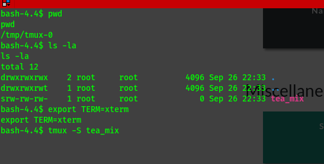
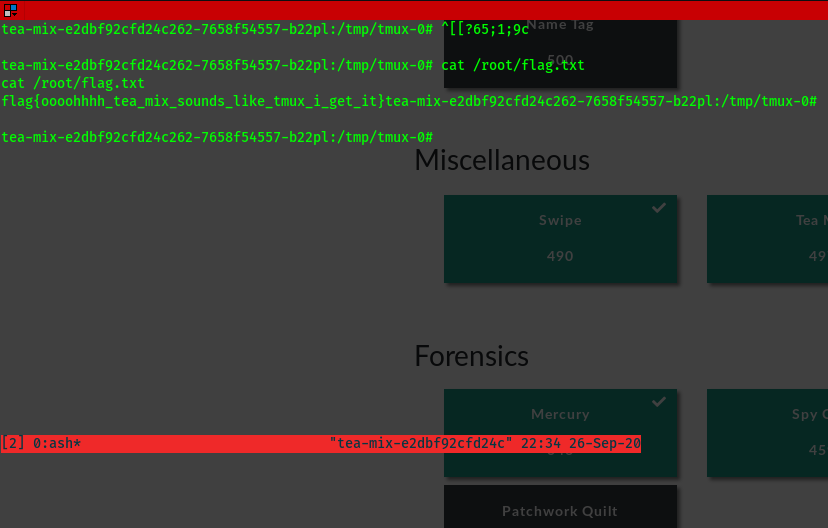

1. Snoop around and find the tmux thingy. 
   It is owned by root but can be used by anyone, so just hijack it.
   Note: If you don't set your TERM to xterm it will give out an error

2. Now that you are root, get your flag
 

